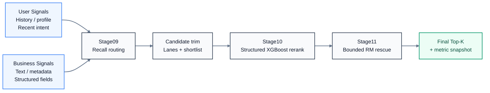
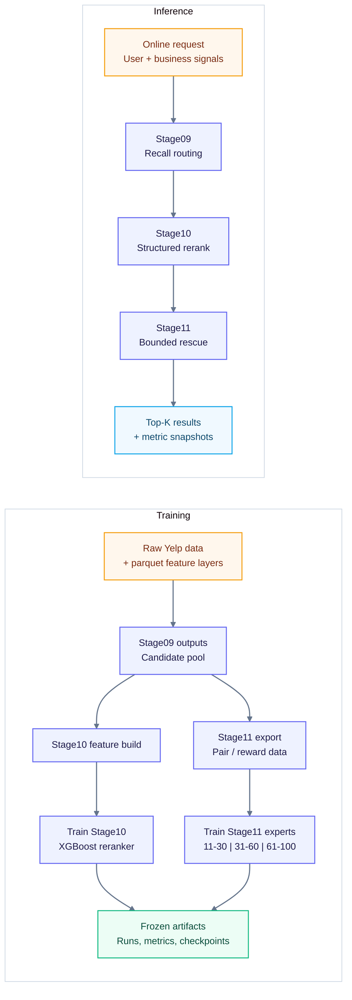

# Yelp Offline Recommendation & Reranking Stack

[English](./README.md) | [中文](./README.zh-CN.md)

An offline recommendation and reranking stack for Yelp restaurant discovery,
covering recall routing (`Stage09`), structured reranking (`Stage10`), and
bounded LLM reward-model rescue reranking (`Stage11`).

Focus: recommendation/search ranking, cold-start portability, structured
feature learning, and controllable LLM-enhanced reranking.

## Why This Repo Matters

This repository is designed to demonstrate the core capabilities expected in
recommendation and search-ranking systems:

- multi-stage ranking design: recall -> rerank -> bounded rescue rerank
- structured feature-based ranking with XGBoost
- evaluation across sparse-to-dense interaction buckets
- controllable LLM usage on bounded candidate windows instead of full-list reranking
- reproducible release artifacts, local checks, and demo tooling

## Problem

Restaurant discovery faces sparse behavior, noisy signals, and long-tail item
exposure. This project aims to build an end-to-end ranking stack that:

- keeps candidate retention high in recall
- improves structured reranking quality
- adds a controllable LLM-based rescue layer
- avoids expensive and unstable full-list LLM reranking

## System Overview

### Ranking Pipeline



### Training Flow Vs. Inference Flow



## Project Highlights

- Built a three-stage ranking stack spanning recall routing, XGBoost reranking,
  and bounded reward-model rescue reranking.
- Improved candidate retention and reduced hard misses on the public `bucket5`
  recall-routing line.
- Demonstrated reranking gains across `bucket2`, `bucket5`, and `bucket10`,
  covering sparse-to-dense interaction thresholds.
- Restricted LLM use to bounded rerank windows (`11-30`, `31-60`, `61-100`)
  to control cost, latency, and rollback risk.
- Preserved a public release surface with launcher wrappers, checked-in metrics,
  smoke tests, and demo commands.

## Results At A Glance

| module | main takeaway | representative result |
| --- | --- | --- |
| `Stage09` | Better candidate retention and fewer hard misses on `bucket5`. | `truth_in_pretrim150 = 0.7451`, `hard_miss = 0.1190` |
| `Stage10` | Stable recall / NDCG gains across sparse-to-dense user buckets. | `bucket5: 0.0935 / 0.0440 -> 0.1261 / 0.0581` |
| `Stage11` | Bounded RM reranking improves rescue ability with controllable cost. | `v120: 0.1973 / 0.0898`, frozen `v124: 0.1857 / 0.0838` |

### Cross-Bucket Stage10 Summary

| bucket | baseline recall / ndcg | reranked recall / ndcg |
| --- | --- | --- |
| `bucket2` | `0.1098 / 0.0513` | `0.1127 / 0.0522` |
| `bucket5` | `0.0935 / 0.0440` | `0.1261 / 0.0581` |
| `bucket10` | `0.0569 / 0.0265` | `0.0772 / 0.0341` |

### Bucket Definitions And Scale

| bucket | user-density meaning | frozen Stage10 eval users | businesses | candidate rows | why it matters |
| --- | --- | ---: | ---: | ---: | --- |
| `bucket2` | cold-start-inclusive trainable users under leave-two-out | `5,344` | `1,798` | `3,058,600` | tests sparse-user portability |
| `bucket5` | mid-to-high interaction users | `1,935` | `1,798` | `935,160` | current main public ranking line |
| `bucket10` | high-interaction users | `738` | `1,794` | `697,299` | cleaner dense-user validation slice |

Scale note: the Stage09 `bucket5` recall audit covers a broader `9,765` truth
users before the fixed Stage10 eval cohort is applied. Finer cold-start cohorts,
such as `0-3` or `4-6` interactions, are script-supported through explicit
cohort CSVs but are not frozen into the headline `current_release` tables yet.
The three Stage10 lines use nearly the same business universe, so the comparison
mainly reflects user-density and candidate-pool differences rather than a
different restaurant set.

## Quickstart

### A. Verification Path

Use this path to validate the checked-in public release surface.

```powershell
python -m venv .venv
.\.venv\Scripts\Activate.ps1
python -m pip install --upgrade pip
python -m pip install -r requirements.txt

python tools/run_release_checks.py --skip-pytest
python tools/run_stage11_model_prompt_smoke.py
python tools/run_full_chain_smoke.py
python tools/run_stage01_11_minidemo.py
.\tools\run_stage09_local.ps1 -CheckOnly
.\tools\run_stage10_bucket5_local.ps1 -CheckOnly
```

### B. Demo Path

Use this path to inspect a canonical Stage11 rescue example and summarize the
current frozen line.

```powershell
python tools/demo_recommend.py show-case --case boundary_11_30
python tools/batch_infer_demo.py --strategy baseline
python tools/batch_infer_demo.py --strategy xgboost
python tools/batch_infer_demo.py --strategy reward_rerank
python tools/mock_serving_api.py --self-test
python tools/load_test_mock_serving.py --requests 20 --concurrency 4 --simulate-fallback-every 5
python tools/demo_recommend.py
```

### C. Cloud-Backed Stage11 Checks

```powershell
# Optional: override the default endpoint if the temporary cloud machine changes.
$env:BDA_CLOUD_HOST="connect.westb.seetacloud.com"
$env:BDA_CLOUD_PORT="20804"
$env:BDA_CLOUD_USER="root"

python tools/cloud_stage11.py local-check
python tools/cloud_stage11.py inventory
python tools/cloud_stage11.py print-ssh
```

### D. Stage11 Reward-Model Surface

The current public `Stage11` surface only documents the frozen `Qwen3.5-9B`
reward-model reranking line.

```powershell
python -m pip install -r requirements-stage11-qlora.txt
python tools/run_stage11_model_prompt_smoke.py
```

For full reproduction and launcher-based runs, see
[docs/project/reproduce_mainline.md](./docs/project/reproduce_mainline.md).

## Expected Output

These files provide the fastest public proof that the current frozen release
surface is present and internally consistent.

```text
PASS release_checks
[PASS] Stage09 local prerequisites are present.
[PASS] Stage10 bucket5 local prerequisites are present.
Batch Inference Demo
- request_id: demo_request_bucket5_001
- strategy: requested=reward_rerank used=reward_rerank
- stage11_rescued_into_top_k: 1
Mock Serving Load Test
- success_rate: 1.0
- fallback_count: 4
{
  "status": "ok",
  "service": "mock_serving_api",
  "mode": "mock_http_service"
}
Case: boundary_11_30
Title: Boundary rescue into top10
Current Frozen Yelp Ranking Review Line
- bucket5: pre=0.0935 / 0.0440, learned=0.1261 / 0.0581
- two-band best-known line: alpha=0.80, recall@10=0.1973, ndcg@10=0.0898
```

Files you should expect to validate immediately:

- `data/output/current_release/stage09/bucket5_route_aware_sourceparity/summary.json`
- `data/output/current_release/stage10/stage10_current_mainline_summary.json`
- `data/output/current_release/stage11/eval/bucket5_tri_band_freeze_v124_alpha036/summary.json`
- `data/metrics/current_release/stage10/stage10_current_mainline_snapshot.csv`
- `data/metrics/current_release/stage11/stage11_bucket5_eval_reference_lines.csv`

## Repository Map

- [scripts/launchers](./scripts/launchers): main launcher entry points
- [tools](./tools): local checks, demos, and helper scripts
- [config/serving.yaml](./config/serving.yaml): mock serving strategy, release id, fallback order, and latency budget
- [tests](./tests): public smoke tests for release surface and metrics
- [data/output/current_release](./data/output/current_release): checked-in release outputs
- [data/metrics/current_release](./data/metrics/current_release): checked-in metric snapshots
- [docs/stage11](./docs/stage11): Stage11 design notes and case studies
- [docs/contracts](./docs/contracts): launcher and environment conventions
- [docs/project](./docs/project): reproduction, frozen-line, and engineering review notes

## More Details

- [System architecture note](./docs/architecture.md)
- [Recruiter-facing search/recommendation pitch](./docs/recruiter_pitch.zh-CN.md)
- [Evaluation buckets and offline evidence](./docs/evaluation.md)
- [Evaluation protocol](./docs/eval_protocol.md)
- [Bad-case taxonomy](./docs/badcase_taxonomy.md)
- [Model card](./docs/model_card.md)
- [Release notes](./docs/release_notes.md)
- [Serving, fallback, and rollback surface](./docs/serving_release.md)
- [Detailed frozen line and data scale](./docs/project/current_frozen_line.md)
- [Design choices and leakage control](./docs/project/design_choices.md)
- [Repository map and entry points](./docs/project/repository_map.md)
- [Stage11 design notes](./docs/stage11/stage11_31_60_only_and_segmented_fusion_20260408.md)
- [Stage11 case notes](./docs/stage11/stage11_case_notes_20260409.md)
- [Stage11 reward-model smoke case](./config/demo/stage11_model_prompt_smoke_case.json)
- [Reproduction guide](./docs/project/reproduce_mainline.md)

## Design Choices

### Why bounded LLM reranking instead of full-list reranking?

- lower cost
- more controllable behavior
- easier rollback
- smaller front-rank disruption

`Stage10` remains the global ranking backbone. `Stage11` only acts on bounded
candidate windows.

### Why validate on `bucket10` before expanding to `bucket5`?

- `bucket10` offers denser behavior and cleaner validation signals
- `bucket5` provides broader coverage closer to the main outward-facing line
- `bucket2` helps test portability under colder user settings

### How leakage is controlled

- routing uses current rank windows rather than hidden truth bands
- shortlist reranking uses current scores and ranks only
- training labels are never exposed at inference time

## Repository Boundary

This repository tracks code, small metrics, manifests, and public technical
notes.

It does not version:

- raw Yelp source data
- large cloud logs
- large model weights
- full prediction dumps

The outward-facing small result files used by the current closeout are kept
under:

- [data/output/current_release](./data/output/current_release)
- [data/output/showcase_history](./data/output/showcase_history)
- [data/metrics/current_release](./data/metrics/current_release)
- [data/metrics/showcase_history](./data/metrics/showcase_history)

The original frozen provenance pack and internal closeout notes are kept
locally for auditing, but are intentionally excluded from the public
repository surface.
