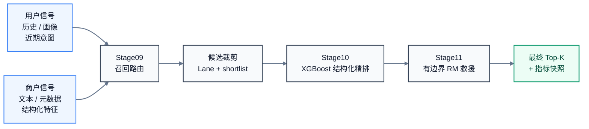
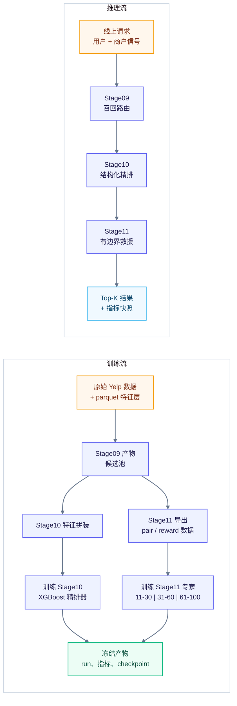

# Yelp 离线推荐与重排系统

[English](./README.md) | [中文](./README.zh-CN.md)

这是一个面向 Yelp 餐饮发现的离线推荐与重排系统，覆盖召回路由（`Stage09`）、
结构化精排（`Stage10`）和有边界的 LLM 奖励模型救援重排（`Stage11`）。

重点：推荐 / 搜索排序、cold-start portability、结构化特征学习，以及在可控
成本下使用 LLM 增强的 reranking。

## 为什么这个仓库值得看

这个仓库的目标，不只是展示“我做了一个模型”，而是展示推荐 / 搜索排序岗位常见的
核心能力：

- 多阶段排序系统设计：recall -> rerank -> bounded rescue rerank
- 基于结构化特征的 XGBoost 排序
- 面向稀疏到稠密用户集的分桶评估
- 只在有边界候选窗口内使用 LLM，而不是做 full-list reranking
- 可复核的 release artifact、本地校验脚本和 demo 工具

## 问题定义

餐饮发现面对的是稀疏行为、噪声信号和长尾商户曝光问题。这个项目希望搭建一条端到端
排序链路，做到：

- 在召回阶段尽量保住真值候选
- 在精排阶段稳定提升排序质量
- 在局部窗口内增加可控的 LLM 救援层
- 避免成本高、行为不稳的全量大模型重排

## 系统总览

### 主链路



### 训练流 vs 推理流



## 项目亮点

- 构建了覆盖 recall routing、XGBoost reranking 和 bounded reward-model
  rescue reranking 的三阶段排序系统。
- 在公开 `bucket5` 召回线上提升了候选保真率，并降低了 hard miss。
- 在 `bucket2`、`bucket5`、`bucket10` 三条用户密度口径上验证了结构化精排增益。
- 将 LLM 使用限制在 `11-30`、`31-60`、`61-100` 的 bounded rerank 窗口内，
  控制成本、时延和回退风险。
- 保留了可公开审阅的 release surface，包括 launcher wrapper、checked-in
  指标、smoke test 和 demo 命令。

## 结果速览

| 模块 | 主要结论 | 代表性结果 |
| --- | --- | --- |
| `Stage09` | `bucket5` 上候选保真率更高，hard miss 更低。 | `truth_in_pretrim150 = 0.7451`，`hard_miss = 0.1190` |
| `Stage10` | 在稀疏到稠密的用户集上都能稳定提升 recall / NDCG。 | `bucket5: 0.0935 / 0.0440 -> 0.1261 / 0.0581` |
| `Stage11` | bounded RM rerank 在可控成本下提升救援能力。 | `v120: 0.1973 / 0.0898`，冻结 `v124: 0.1857 / 0.0838` |

### Stage10 分桶结果

| bucket | 基线 recall / ndcg | 重排后 recall / ndcg |
| --- | --- | --- |
| `bucket2` | `0.1098 / 0.0513` | `0.1127 / 0.0522` |
| `bucket5` | `0.0935 / 0.0440` | `0.1261 / 0.0581` |
| `bucket10` | `0.0569 / 0.0265` | `0.0772 / 0.0341` |

### 分桶定义与规模

| bucket | 用户密度含义 | 冻结 Stage10 评估用户数 | 商家数 | 候选行数 | 为什么要看 |
| --- | --- | ---: | ---: | ---: | --- |
| `bucket2` | leave-two-out 下仍可训练、含冷启动倾向的用户 | `5,344` | `1,798` | `3,058,600` | 验证稀疏用户可迁移性 |
| `bucket5` | 中高交互用户 | `1,935` | `1,798` | `935,160` | 当前主要公开排序线 |
| `bucket10` | 高交互用户 | `738` | `1,794` | `697,299` | 更干净的高密度验证切片 |

规模说明：Stage09 的 `bucket5` 召回审计覆盖更宽的 `9,765` 个 truth users；
进入 Stage10 时再使用固定 eval cohort。更细的冷启动子集，例如 `0-3`
或 `4-6` 交互用户，当前已经可以通过显式 cohort CSV 重放，但还没有冻结进
headline `current_release` 表。三条 Stage10 线使用的商户 universe 基本一致，
因此对比主要反映用户密度和候选池差异，而不是换了一套餐厅集合。

## Quickstart

### A. 验证路径

这条路径用于验证仓库里已经 check in 的公开 release surface。

```powershell
python -m venv .venv
.\.venv\Scripts\Activate.ps1
python -m pip install --upgrade pip
python -m pip install -r requirements.txt

python tools/run_release_checks.py --skip-pytest
python tools/run_stage11_model_prompt_smoke.py
python tools/run_full_chain_smoke.py
python tools/run_stage01_11_minidemo.py
.\tools\run_stage09_local.ps1 -CheckOnly
.\tools\run_stage10_bucket5_local.ps1 -CheckOnly
```

### B. Demo 路径

这条路径用于展示一个 canonical Stage11 rescue case，并快速浏览当前冻结线。

```powershell
python tools/demo_recommend.py show-case --case boundary_11_30
python tools/batch_infer_demo.py --strategy baseline
python tools/batch_infer_demo.py --strategy xgboost
python tools/batch_infer_demo.py --strategy reward_rerank
python tools/mock_serving_api.py --self-test
python tools/load_test_mock_serving.py --requests 20 --concurrency 4 --simulate-fallback-every 5
python tools/demo_recommend.py
```

### C. 云端 Stage11 检查

```powershell
# 如果临时云端机器变化，可以覆盖默认 endpoint。
$env:BDA_CLOUD_HOST="connect.westb.seetacloud.com"
$env:BDA_CLOUD_PORT="20804"
$env:BDA_CLOUD_USER="root"

python tools/cloud_stage11.py local-check
python tools/cloud_stage11.py inventory
python tools/cloud_stage11.py print-ssh
```

### D. Stage11 奖励模型检查

当前公开 `Stage11` 只说明已经冻结的 `Qwen3.5-9B` 奖励模型重排线。

```powershell
python -m pip install -r requirements-stage11-qlora.txt
python tools/run_stage11_model_prompt_smoke.py
```

完整复现路径和 launcher 入口见：
[docs/project/reproduce_mainline.md](./docs/project/reproduce_mainline.md)。

## 预期输出

下面这些文件和终端输出，是验证当前冻结结果面存在且自洽的最快公开证据。

```text
PASS release_checks
[PASS] Stage09 local prerequisites are present.
[PASS] Stage10 bucket5 local prerequisites are present.
Batch Inference Demo
- request_id: demo_request_bucket5_001
- strategy: requested=reward_rerank used=reward_rerank
- stage11_rescued_into_top_k: 1
Mock Serving Load Test
- success_rate: 1.0
- fallback_count: 4
{
  "status": "ok",
  "service": "mock_serving_api",
  "mode": "mock_http_service"
}
Case: boundary_11_30
Title: Boundary rescue into top10
Current Frozen Yelp Ranking Review Line
- bucket5: pre=0.0935 / 0.0440, learned=0.1261 / 0.0581
- two-band best-known line: alpha=0.80, recall@10=0.1973, ndcg@10=0.0898
```

第一次检查时，建议确认这些文件已经存在：

- `data/output/current_release/stage09/bucket5_route_aware_sourceparity/summary.json`
- `data/output/current_release/stage10/stage10_current_mainline_summary.json`
- `data/output/current_release/stage11/eval/bucket5_tri_band_freeze_v124_alpha036/summary.json`
- `data/metrics/current_release/stage10/stage10_current_mainline_snapshot.csv`
- `data/metrics/current_release/stage11/stage11_bucket5_eval_reference_lines.csv`

## 仓库地图

- [scripts/launchers](./scripts/launchers)：主 launcher 入口
- [tools](./tools)：本地校验、demo 和辅助脚本
- [config/serving.yaml](./config/serving.yaml)：mock serving 策略、release id、fallback 顺序和 latency budget
- [tests](./tests)：release surface 与指标快照的公开 smoke tests
- [data/output/current_release](./data/output/current_release)：checked-in release 输出
- [data/metrics/current_release](./data/metrics/current_release)：checked-in 指标快照
- [docs/stage11](./docs/stage11)：Stage11 设计说明与案例分析
- [docs/contracts](./docs/contracts)：launcher 与环境变量约定
- [docs/project](./docs/project)：复现、冻结线说明和工程审阅文档

## 更多细节

- [系统架构页](./docs/architecture.zh-CN.md)
- [面向招聘方的搜广推项目说明](./docs/recruiter_pitch.zh-CN.md)
- [离线评估页](./docs/evaluation.zh-CN.md)
- [实验协议](./docs/eval_protocol.md)
- [bad case 分类](./docs/badcase_taxonomy.md)
- [model card](./docs/model_card.md)
- [release notes](./docs/release_notes.md)
- [serving / fallback / rollback 说明](./docs/serving_release.zh-CN.md)
- [详细冻结线与数据规模](./docs/project/current_frozen_line.zh-CN.md)
- [设计取舍与泄露控制](./docs/project/design_choices.zh-CN.md)
- [仓库地图与推荐入口](./docs/project/repository_map.zh-CN.md)
- [Stage11 设计说明](./docs/stage11/stage11_31_60_only_and_segmented_fusion_20260408.zh-CN.md)
- [Stage11 案例说明](./docs/stage11/stage11_case_notes_20260409.zh-CN.md)
- [Stage11 奖励模型 smoke case](./config/demo/stage11_model_prompt_smoke_case.json)
- [主线复现指南](./docs/project/reproduce_mainline.md)

## 设计取舍

### 为什么用 bounded LLM rerank，而不是 full-list rerank？

- 成本更低
- 行为更可控
- 更容易回退
- 对前排结果的扰动更小

在这套设计里，`Stage10` 仍然是全局排序骨架，`Stage11` 只处理有边界的候选窗口。

### 为什么先验证 `bucket10`，再扩到 `bucket5`？

- `bucket10` 的行为密度更高，验证信号更干净
- `bucket5` 覆盖面更大，更接近当前主展示口径
- `bucket2` 用来验证在更冷用户集上的可迁移性

### 怎么控制数据泄露？

- 专家路由依据当前排名窗口，而不是隐藏真值分段
- shortlist reranking 只使用当前分数和当前名次
- 训练标签不会在推理时暴露

## 仓库边界

当前仓库版本化的内容包括代码、小型指标、manifest 和公开技术文档。

以下内容不做版本化：

- 原始 Yelp 数据
- 大体量云端日志
- 大模型权重
- 全量预测结果

当前对外展示用的小结果文件统一放在：

- [data/output/current_release](./data/output/current_release)
- [data/output/showcase_history](./data/output/showcase_history)
- [data/metrics/current_release](./data/metrics/current_release)
- [data/metrics/showcase_history](./data/metrics/showcase_history)

原始冻结 provenance pack 和内部收口文档继续保留在本地，用于审计和追溯，
但不纳入当前公开仓库表面。
