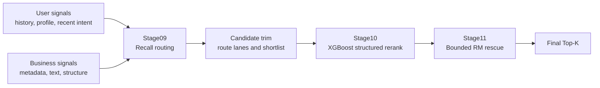
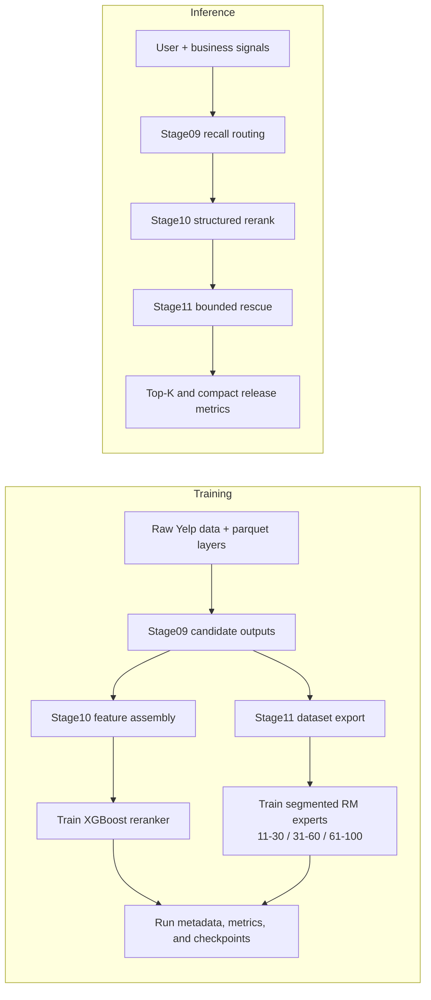

# Architecture

This page is the interviewer-facing system overview for the current Yelp offline
ranking stack.

## System Goal

The repository is organized around one practical ranking objective:

- keep candidate retention high enough for downstream ranking
- build a strong structured rerank backbone that remains portable across user
  density buckets
- apply LLM-enhanced reranking only on a bounded shortlist where cost, latency,
  and rollback risk stay controllable

## Three-Layer Responsibilities

| layer | role | main output |
| --- | --- | --- |
| `Stage09` recall routing | assemble multi-source candidates, route challenger lanes, and protect truth retention before heavy reranking | trimmed candidate pool and recall audit artifacts |
| `Stage10` structured reranking | provide the global ordering backbone with structured, text, and competition-aware features | ranked candidate list, bucket metrics, and model artifacts |
| `Stage11` bounded RM rescue rerank | locally rescue underweighted candidates inside a bounded rerank window | rescue-aware reranked shortlist and Stage11 eval summaries |

Current Stage11 model surface:

- frozen reward-model mainline: one shared `Qwen3.5-9B` backbone
- optional prompt-only / persona probes: `Qwen3.5-35B-A3B` and `Qwen3-30B-A3B`
  experiments documented separately from the frozen line

## Main Inference Path

## Training Flow Vs. Inference Flow

## Why The Rerank Is Bounded

The repository does not let the LLM or reward model rerank the full list.

The current design keeps `Stage10` as the global backbone and uses `Stage11`
only on a bounded candidate window because this:

- lowers compute cost
- reduces latency and demo fragility
- limits front-rank disruption
- keeps rollback and release validation simpler

This is also why the release surface can keep a clear fallback ladder:

- `Stage11` champion path
- `Stage10` aligned fallback
- `Stage09` emergency baseline

That release policy is documented in more detail in
[serving_release.md](./serving_release.md).

## Why Not Full-List LLM Reranking

Full-list LLM reranking was intentionally not used for the current repository
line.

Primary reasons:

- it is harder to cost-control and benchmark consistently
- it weakens the role separation between global ranking and local rescue
- it makes rollback and offline debugging less clean
- it is a worse fit for a local-machine review workflow and a cloud-backed
  Stage11 training workflow

## Design Reading Order

If you want the shortest path through the engineering story:

1. read this page for the system shape
2. read [evaluation.md](./evaluation.md) for the offline evidence
3. read [serving_release.md](./serving_release.md) for the release, fallback,
   and rollback model

## Primary References

- [../README.md](../README.md)
- [project/data_lineage_and_storage.md](./project/data_lineage_and_storage.md)
- [project/challenges_and_tradeoffs.md](./project/challenges_and_tradeoffs.md)
- [stage11/stage11_31_60_only_and_segmented_fusion_20260408.md](./stage11/stage11_31_60_only_and_segmented_fusion_20260408.md)
