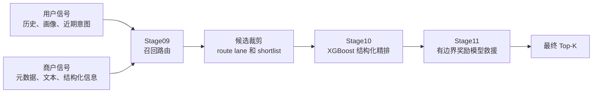
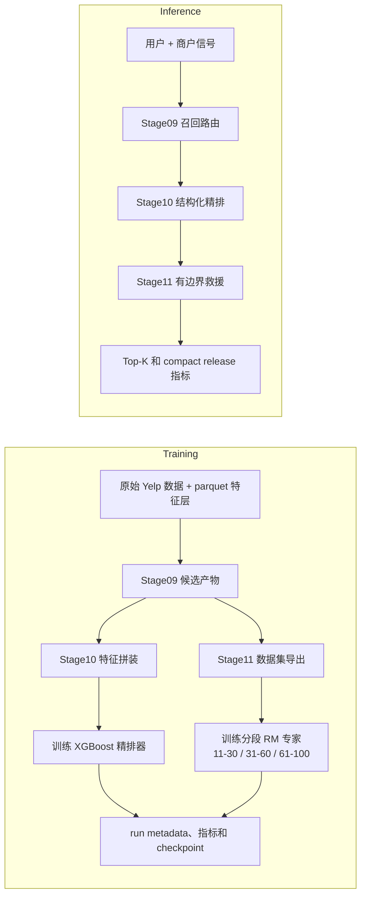

# 架构说明

这份文档是给面试官和招聘方看的系统概览页，不是项目归档页。

## 系统目标

当前仓库围绕一个实际排序目标组织：

- 在进入重排序前尽量保住高质量候选
- 建立一个能跨不同用户密度分桶迁移的结构化精排骨架
- 只在一个有边界的短名单上使用 LLM / 奖励模型增益，控制成本、时延和回退风险

## 三层职责

| 层 | 作用 | 主要产物 |
| --- | --- | --- |
| `Stage09` 召回路由 | 聚合多来源候选、组织 route lane、在重排序前保护真值保留率 | 候选池、裁剪结果、召回审计产物 |
| `Stage10` 结构化精排 | 作为全局排序骨架，消费结构化、文本和竞争关系特征 | 排序结果、分桶指标、模型产物 |
| `Stage11` 有边界奖励模型救援重排 | 在受控 shortlist 内对被低估候选做局部救援 | 重排后的 shortlist 和 Stage11 评估摘要 |

当前 Stage11 模型面分成两类：

- 冻结 reward-model 主线：共享 `Qwen3.5-9B` 主干
- 额外 prompt-only / persona probe：`Qwen3.5-35B-A3B` 和
  `Qwen3-30B-A3B`，这类实验与当前 freeze 线分开记录

## 主推理链路

## 训练流 vs 推理流

## 为什么 Stage11 要有边界

当前仓库不会让 LLM / 奖励模型重排全量候选。

`Stage10` 仍然是全局排序骨架，`Stage11` 只作用于有边界的候选窗口。这样做可以：

- 降低计算成本
- 降低时延和 demo 脆弱性
- 控制前排扰动
- 让回退和 release 验证更简单

这也是为什么当前 release surface 可以保持清晰的回退梯度：

- `Stage11` champion 路径
- `Stage10` aligned fallback
- `Stage09` emergency baseline

对应的 release policy 见 [serving_release.zh-CN.md](./serving_release.zh-CN.md)。

## 为什么不用全量 LLM 重排

当前主线刻意不使用 full-list LLM reranking，原因主要是：

- 成本和时延更难控制
- 会削弱“全局排序骨架”和“局部救援层”的职责边界
- rollback 和离线调试不够干净
- 不利于本地评审 + 云端 Stage11 训练这种工作流

## 推荐阅读顺序

如果只想最快看懂工程故事线：

1. 先看这页，理解系统长什么样
2. 再看 [evaluation.zh-CN.md](./evaluation.zh-CN.md)，理解离线证据
3. 最后看 [serving_release.zh-CN.md](./serving_release.zh-CN.md)，理解 release、fallback 和 rollback

## 主要参考

- [../README.zh-CN.md](../README.zh-CN.md)
- [project/data_lineage_and_storage.md](./project/data_lineage_and_storage.md)
- [project/challenges_and_tradeoffs.md](./project/challenges_and_tradeoffs.md)
- [stage11/stage11_31_60_only_and_segmented_fusion_20260408.zh-CN.md](./stage11/stage11_31_60_only_and_segmented_fusion_20260408.zh-CN.md)
